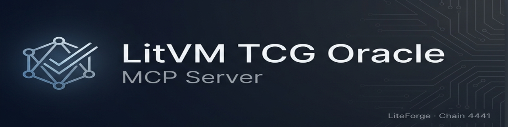
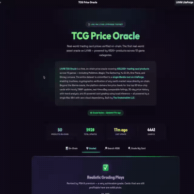

<p align="center">
  
</p>

<h3 align="center">The first Model Context Protocol server for the Mantle ecosystem.</h3>

<p align="center">
Plug any AI agent into 433K+ real trading card prices across 13 games — every price backed by on-chain Merkle proofs, not blind trust.
</p>

<p align="center">
  <a href="https://pypi.org/project/litvm-tcg-oracle/"></a>&nbsp;
  &nbsp;
  <a href="https://github.com/sailorpepe/litvm-tcg-oracle-mcp/blob/main/LICENSE.md"></a>&nbsp;
  <a href="https://explorer.mantle.xyz"></a>
</p>

<!-- mcp-name: io.github.sailorpepe/litvm-tcg-oracle -->

<div align="center">



*Browse 433K+ cards with on-chain verified prices*

</div>

---

## 📑 Table of Contents

- [Why This Exists](#why-this-exists)
- [Data Coverage](#data-coverage)
- [Quick Start](#quick-start)
- [Tools](#tools)
  - [search_cards](#1-search_cards--full-text-search)
  - [get_price](#2-get_price--price--history)
  - [get_merkle_proof](#3-get_merkle_proof--on-chain-verification)
  - [oracle_status](#4-oracle_status--live-on-chain-status)
  - [simulate_price](#5-simulate_price--risk-forecast)
  - [get_market_snapshot](#6-get_market_snapshot--market-overview)
- [Architecture](#architecture)
- [Configuration](#configuration)
- [On-Chain Contracts](#on-chain-contracts)
- [License & Commercial Use](#-license--commercial-use)
- [Links](#links)

---

## Why This Exists

AI agents are making decisions with market data — but how do they know the data is real?

Regular APIs require **trust**. You call an endpoint, you get a number, and you hope it's accurate. There's no way to verify it. For AI agents managing portfolios, executing trades, or assessing collateral, this is a problem.

**This MCP server solves it.** Every actively-priced product in the oracle is committed to a Merkle root on-chain daily. Any agent can request a Merkle proof for any card and independently verify the price against the Mantle blockchain — no trust required.

### What Makes This Different

| Feature | Regular Price API | LitVM TCG Oracle |
|---------|------------------|-----------------|
| **Data source** | Opaque server | 13.5M+ verified market observations |
| **Verification** | Trust the server | Merkle proof → on-chain verification |
| **Forecasting** | None | Calibrated conformal risk forecast — honest VaR |
| **Coverage** | Limited | 433K products, 276K actively priced |
| **For AI agents** | Manual integration | MCP — works in Claude, GPT, Cursor |
| **Blockchain** | None | Mantle Network |

---

## Data Coverage

The oracle indexes the full TCGPlayer catalog and tracks live market prices:

| Metric | Count | Description |
|--------|-------|-------------|
| **Total catalog** | 433,671 | All products across 13 games and 85 categories |
| **Actively priced** | 276,788 | Products with a current `market_price > 0` |
| **Price observations** | 13.5M+ | Daily snapshots collected over months |
| **Merkle-provable** | 276,788 | Only actively-priced products are committed on-chain |
| **Zero-price entries** | ~157K | Tokens, promos, bundles, foreign-market-only — searchable but not provable |

> **Transparency note:** Not every product in the catalog has a market price. ~157K entries are catalog metadata with no trading activity (token cards, unopened case listings, foreign-language promos, etc.). These are returned by `search_cards` but will return a `404` from `get_merkle_proof` because zero-price products are not committed to the Merkle tree. This is by design — you wouldn't commit unverifiable data on-chain.

---

## Quick Start

### Install

```bash
pip install litvm-tcg-oracle
```

For live on-chain contract reads (optional):
```bash
pip install litvm-tcg-oracle[chain]
```

### Claude Desktop

Add to `~/.claude/claude_desktop_config.json`:

```json
{
  "mcpServers": {
    "litvm-tcg-oracle": {
      "command": "litvm-tcg-oracle"
    }
  }
}
```

### Cursor / VS Code

Add to your MCP settings:

```json
{
  "litvm-tcg-oracle": {
    "command": "litvm-tcg-oracle"
  }
}
```

Then ask your AI: *"Search for Charizard Base Set and simulate the price over 90 days"*

---

## Tools

### 1. `search_cards` — Full-Text Search

Search the full 433K product catalog using FTS5 full-text search.

```
→ search_cards(query="black lotus", game="Magic", limit=5)
```

Covers 13 games: Pokémon, Magic: The Gathering, Yu-Gi-Oh!, One Piece, Disney Lorcana, Flesh & Blood, Dragon Ball Super, Digimon, Star Wars, Union Arena, MetaZoo, Cardfight Vanguard, My Hero Academia.

Returns product IDs needed for `get_price` and `get_merkle_proof`.

---

### 2. `get_price` — Price + History

Get current market price and daily price history for any card.

```
→ get_price(card_name="Charizard Base Set Holo", days=90)
```

Returns market price, low (buy-it-now) price, and a daily price array. This history is what powers the risk-forecast calibration — the same data the forecast engine uses to calculate drift, volatility, and conformal bands.

---

### 3. `get_merkle_proof` — On-Chain Verification

**This is the key differentiator.** Get a cryptographic proof that a card's price was committed to the Mantle blockchain.

```
→ get_merkle_proof(product_id=84198)
```

Returns a `bytes32[]` proof array (19 hashes for the current tree) that can be submitted to the `MerklePriceOracle` contract on Mantle Network to verify the price without trusting any server.

**Verification flow:**
1. Call `get_merkle_proof(product_id)` → receive proof + leaf data
2. Submit to `MerklePriceOracle.verifyPrice()` on Mantle Network
3. Contract checks the leaf against the committed Merkle root
4. Returns `true` if and only if the price matches exactly

**Leaf encoding** (matches Solidity):
```
keccak256(bytes.concat(keccak256(abi.encode(
  productId, categoryId, name, marketPrice, lowPrice
))))
```

Standard: OpenZeppelin MerkleProof (double-hash, sorted pairs)

> Only the 276K actively-priced products are in the Merkle tree. Zero-price catalog entries return a `404` — this is correct behavior.

---

### 4. `oracle_status` — Live On-Chain Status

Reads directly from the Mantle Network blockchain via Caldera RPC — not cached data.

```
→ oracle_status()
```

Returns:
- **MerklePriceOracle**: Merkle root, total products, freshness, total root updates
- **TCGPriceOracleV2**: Total TWAP updates, last update timestamp, 660+ confirmed updates
- **Database**: Card count, price rows, latest data date

---

### 5. `simulate_price` — Risk Forecast

Stochastic price simulations calibrated from real market data.

```
→ simulate_price(card_name="Charizard Base Set", days=30)   # conformal default — pass model="merton" for Monte Carlo
```

#### How the Simulation Works

This is not placeholder math. Every simulation parameter is calibrated from real price observations stored in the oracle database.

**Calibration Pipeline:**

```
Card name → FTS5 search → product_id → price_history (up to 365 days)
  → weekly resampling (ISO week buckets)
  → log-returns between weekly closing prices
  → annualized drift (μ) and volatility (σ)
  → jump detection via 2σ threshold on time-scaled returns
  → 10,000 vectorized numpy simulation paths
  → percentile forecast bands + VaR/CVaR risk metrics
```

**Why weekly resampling?** Daily TCG prices have irregular gaps (weekends, holidays, no sales). Weekly resampling produces stable drift estimates by collapsing daily observations into ISO-week buckets and computing log-returns between weekly closing prices. This eliminates the √Δt scaling problem that plagues irregularly-spaced data.

**Models:**

**Regime-aware conformal calibration (default)**
Distribution-free bands calibrated on real cross-card price history. Produces *honest* VaR — out-of-sample, a "5% loss" happens about 5% of the time — with no Monte Carlo and fully deterministic output anyone can reproduce. Each card also gets two letter grades: **Safe-Hold** (downside) and **Momentum** (direction). The Monte Carlo models below are opt-in via `model=`.

**Geometric Brownian Motion (GBM)**
```
dS = μ·S·dt + σ·S·dW
```
Standard log-normal diffusion — the foundation of Black-Scholes option pricing. Assumes continuous price movements with no sudden jumps.

**Merton Jump-Diffusion** (opt-in)
```
dS = (μ − λk)·S·dt + σ·S·dW + J·S·dN
```
Extends GBM by adding Poisson-distributed price jumps to capture sudden market events — buyouts, influencer videos, ban lists, set reprints, tournament results.

| Symbol | Meaning | Calibration |
|--------|---------|-------------|
| `μ` | Drift (annualized return) | Weekly log-return mean × 52 |
| `σ` | Volatility | Weekly log-return stdev × √52 |
| `λ` | Jump intensity (jumps/year) | Count of returns > 2σ, annualized |
| `μⱼ` | Jump mean | Average of detected jump returns |
| `σⱼ` | Jump volatility | Stdev of detected jump returns |
| `k` | Drift compensator | `E[eᴶ] - 1` (ensures fair pricing) |
| `dW` | Brownian motion | Standard Wiener process |
| `dN` | Jump arrival | Poisson(λ·dt) |

**Risk Metrics:**
- **VaR 95%**: "There is a 5% chance the price drops below $X over N days"
- **CVaR 95% (Expected Shortfall)**: "If that tail event occurs, the average loss lands at $Y"

**Transparency:**
- `param_source: "calibrated_from_market_data"` — real parameters from this card's history
- `param_source: "default_tcg_priors"` — insufficient data (<5 points), using conservative priors (3% drift, 40% vol)
- Standard errors reported for μ, σ, λ to quantify parameter uncertainty
- Mean-reversion detection via lag-1 autocorrelation

**References:**
- Merton, R.C. (1976). *Option pricing when underlying stock returns are discontinuous.* Journal of Financial Economics, 3(1-2), 125-144.
- Black, F. & Scholes, M. (1973). *The Pricing of Options and Corporate Liabilities.* Journal of Political Economy, 81(3), 637-654.

---

### 6. `get_market_snapshot` — Market Overview

Top cards by value for any game.

```
→ get_market_snapshot(game="Pokemon", limit=25)
```

---

## Architecture

```
┌──────────────────┐       MCP (stdio)       ┌──────────────────────┐
│                  │ ◄─────────────────────► │                      │
│    AI Agent      │                          │  litvm-tcg-oracle    │
│  (Claude, GPT,   │                          │  MCP Server          │
│   Cursor, etc.)  │                          │  (pip install)       │
│                  │                          │                      │
└──────────────────┘                          └──────┬───────┬───────┘
                                                     │       │
                                          HTTPS      │       │  RPC
                                                     │       │
                                                     ▼       ▼
                                     ┌──────────────────┐  ┌─────────────┐
                                     │  Oracle REST API │  │  Mantle Network  │
                                     │  (Mac Mini)      │  │  Mantle Network │
                                     │                  │  │             │
                                     │  433K products   │  │  Merkle +   │
                                     │  13.5M prices    │  │  V2 Oracle  │
                                     │  FTS5 search     │  │  contracts  │
                                     └──────────────────┘  └─────────────┘
```

**Off-chain layer** (REST API): Search, prices, market data, simulation calibration  
**On-chain layer** (Mantle Network RPC): Merkle root verification, oracle contract status, TWAP feeds

The Mac Mini runs the daily pipeline (scrape → price update → Merkle root → on-chain push) and serves the REST API. The MCP server is a thin client that any developer can `pip install` and connect to Claude, GPT, or Cursor.

---

## Configuration

| Variable | Default | Description |
|----------|---------|-------------|
| `LITVM_ORACLE_URL` | `https://oracle.the-undesirables.com` | Override the API base URL |

### Local Development

```bash
export LITVM_ORACLE_URL=http://localhost:8402
litvm-tcg-oracle
```

---

## On-Chain Contracts

| Contract | Address | Purpose |
|----------|---------|---------|
| **MerklePriceOracle** | [`0x96B124...170Cd`](https://explorer.mantle.xyz/address/0x96B124f50156589274ADF8F674509374752170Cd) | Daily Merkle root for 276K products |
| **TCGPriceOracleV2** | [`0x04a128...203072`](https://explorer.mantle.xyz/address/0x04a128F4a7A0588D259F8abe9E260BbffF203072) | Hourly TWAP for top 50 blue-chip cards |

Both contracts are deployed on **Mantle Testnet** (Chain ID 4441) via the [Caldera RPC](https://liteforge.rpc.caldera.xyz/http).

---

## 📝 License & Commercial Use

This project is licensed under the **[Business Source License 1.1 (BUSL-1.1)](LICENSE.md)**.

We build in public and support the developer ecosystem — but we also protect the infrastructure and IP of **The Undesirables LLC**.

### ✅ What You CAN Do (Free)

- **Personal & Educational Use** — Download, modify, and run locally for learning, research, or personal projects.
- **Non-Competing Applications** — Integrate this MCP server into your app, provided your app does not offer TCG market intelligence, pricing aggregation, AI card grading, or on-chain price oracle services as its primary function.
- **MCP / Agent Integration** — Connect your AI agent to this server for non-commercial use.
- **Community Contributions** — Security audits, bug fixes, and PRs are always welcome.

### 🚫 What You CANNOT Do (Use Limitation)

- **Competing Oracle** — You may not use this code to operate a competing price oracle service on Mantle Network or any compatible chain.
- **Commercial Resale** — You may not wrap our API, data pipelines, or AI models into a paid service without a commercial license.
- **Hosted SaaS** — You may not host this software as a service for third parties without written permission.

### 🔓 Open-Source Conversion

On **June 1, 2030** (or 4 years after the first public release of each version), this code automatically converts to the **MIT License** — fully open source, forever.

### 🤝 Commercial Licensing

Building a commercial product? Want guaranteed API access or white-label integration? Contact us:

📧 **theundesirables7@gmail.com** · 🐦 **[@undesirables_ai](https://x.com/undesirables_ai)**

© 2026 The Undesirables LLC

---

## Links

- **Website**: [the-undesirables.com](https://the-undesirables.com)
- **Oracle API**: [oracle.the-undesirables.com](https://oracle.the-undesirables.com)
- **Mantle Network**: [mantle.xyz](https://mantle.xyz)
- **Block Explorer**: [explorer.mantle.xyz](https://explorer.mantle.xyz)
- **X**: [@undesirables_ai](https://x.com/undesirables_ai)

*Built by The Undesirables LLC — the first and only oracle on Mantle Network.*

---

<div align="center">

⭐ **If this project helped you, please star this repo** — it helps others find it.

[Report Bug](../../issues) · [Request Feature](../../issues)

</div>
